# Microservice de gestion des comptes bancaires
Dans le cadre de la mise en pratique des notions étudiées en **architecture microservices**, nous avons commencé par la réalisation d'un **microservice de gestion de comptes bancaires** avec **Spring Boot**.

L'objectif de ce projet est de mettre en pratique progressivement les différents concepts et technologies nécessaires à la conception d'un microservice, en commençant par la création d'une API REST, puis en ajoutant différentes fonctionnalités et couches à l'application.

Ce microservice permet de gérer des comptes bancaires à travers plusieurs types d'API :

- **REST API classique**
- **Spring Data REST**
- **GraphQL API**

# Étapes de réalisation

## 1. Création du projet Spring Boot

La première étape consiste à créer un projet **Spring Boot** avec les dépendances nécessaires au développement du microservice.

###  Dépendances utilisées

---

## 2. Création de l'entité JPA `Compte`

L'entité `BankAccount` représente un compte bancaire dans l'application.

Elle est associée à une table dans la base de données grâce à **JPA**.

###  Structure de l'entité

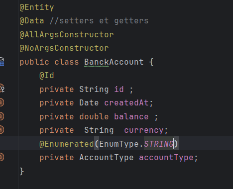

## 3. Création de l'interface `CompteRepository`

Pour accéder aux données de l'entité `BankAccount`, une interface `BankAccountRepository` est créée.

Elle hérite de `JpaRepository`, ce qui permet de bénéficier automatiquement des principales opérations **CRUD**.

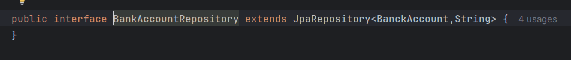

## 4. Test de la couche DAO

La couche **DAO (Data Access Object)** est ensuite testée afin de vérifier que la communication entre l'application et la base de données fonctionne correctement.

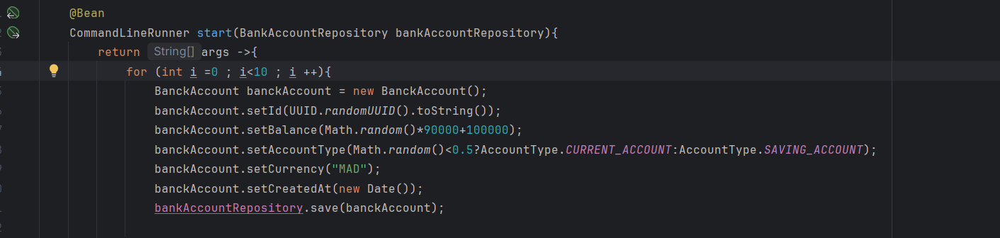
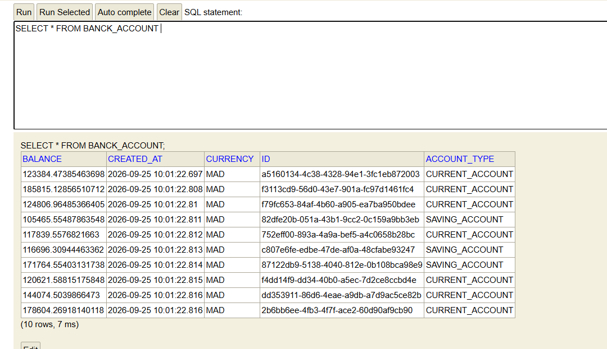

## 5. Création du Web Service RESTful

Après avoir mis en place l'entité `BankAccount` et le `BankAccountRepository`, l'étape suivante consiste à créer un **Web Service RESTful** permettant aux clients externes de gérer les comptes bancaires.

Pour cela, un contrôleur REST est créé à l'aide de l'annotation `@RestController`.

    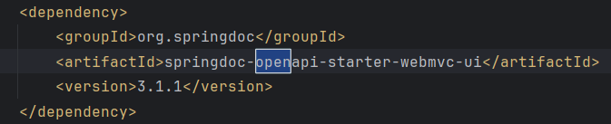
   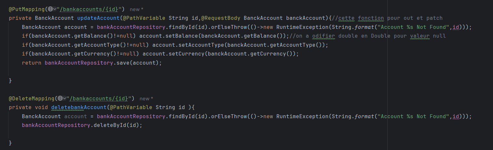

`
## 6. Test du microservice avec Postman

Après la création du Web Service REST, le microservice est testé à l'aide de **Postman** afin de vérifier le bon fonctionnement des différentes opérations CRUD.

###  Tests réalisés

Les différentes opérations testées sont :

| Méthode HTTP | Endpoint                 | Description |
|---|--------------------------|---|
| `GET` | `/api/bankAccounts`      | Récupérer tous les comptes |
| `GET` | `/api/bankAccounts/{id}` | Récupérer un compte par son identifiant |
| `POST` | `/api/bankAccounts`      | Créer un nouveau compte |
| `PUT` | `/api/bankAccounts/{id}` | Modifier un compte |
| `DELETE` | `/api/bankAccounts/{id}`      | Supprimer un compte |

###  Création d'un compte

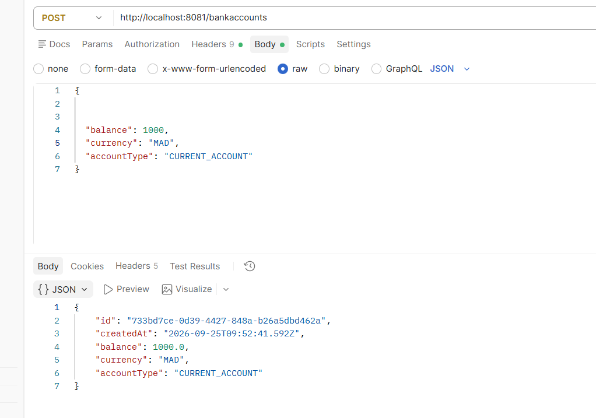

### Récupération des comptes

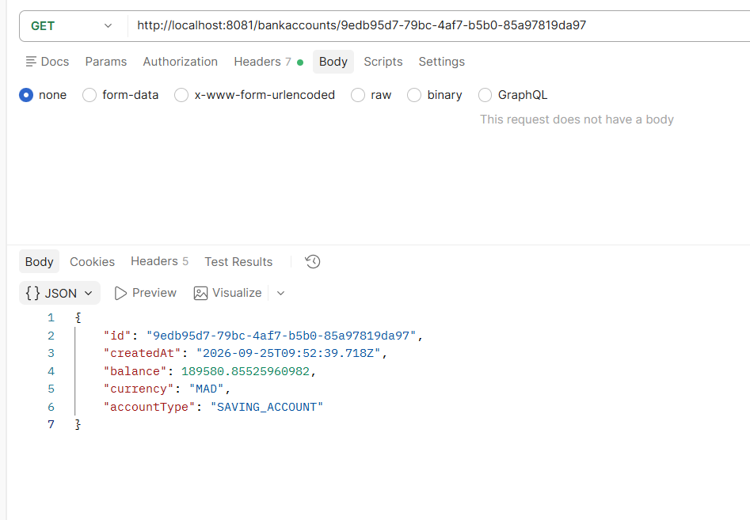

###  Récupération d'un compte

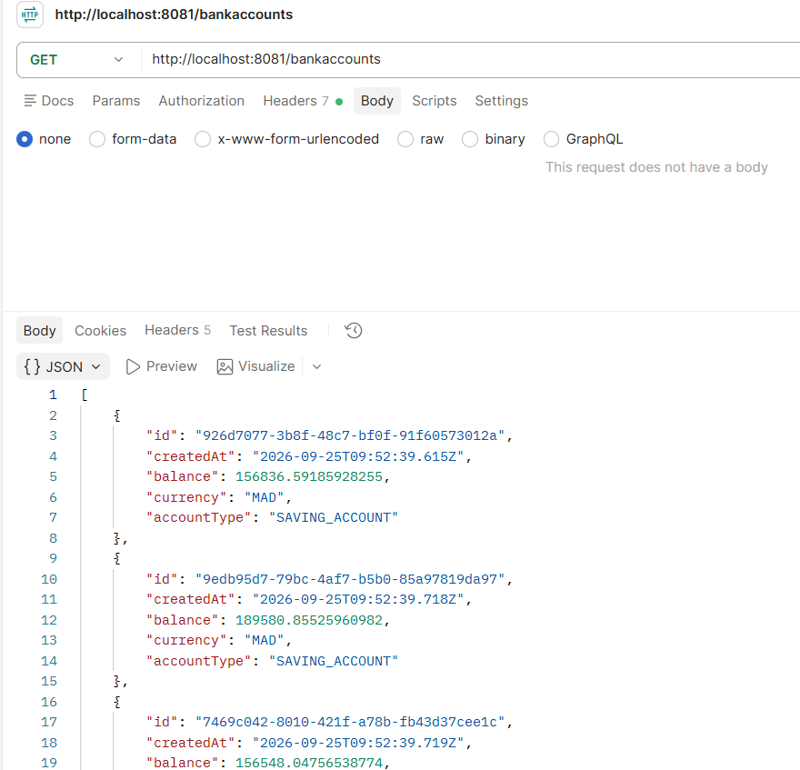

###  Modification d'un compte

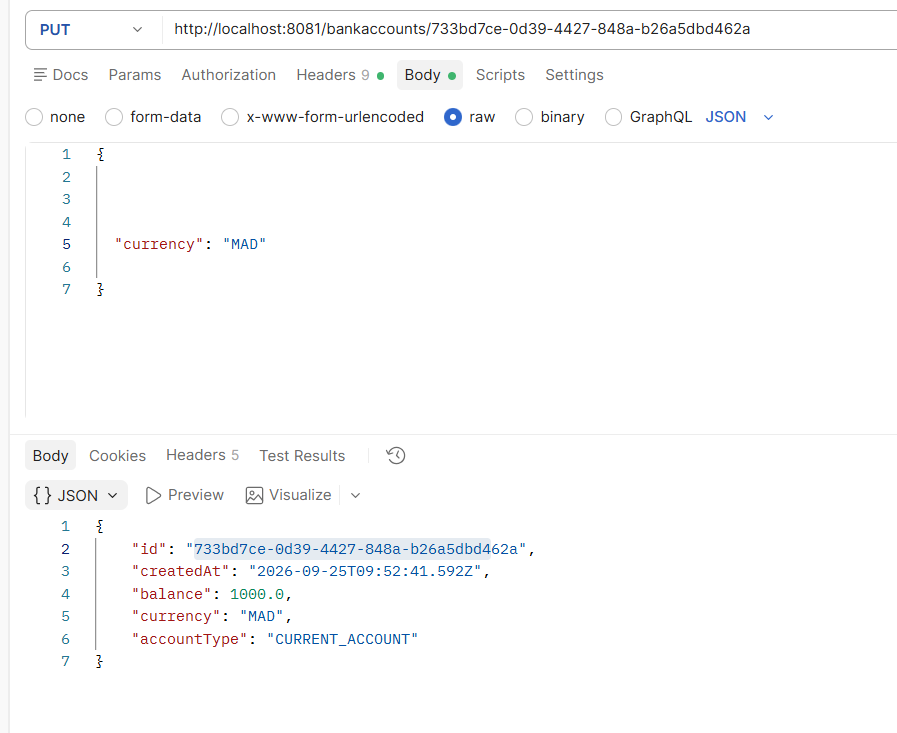
###  Suppression d'un compte

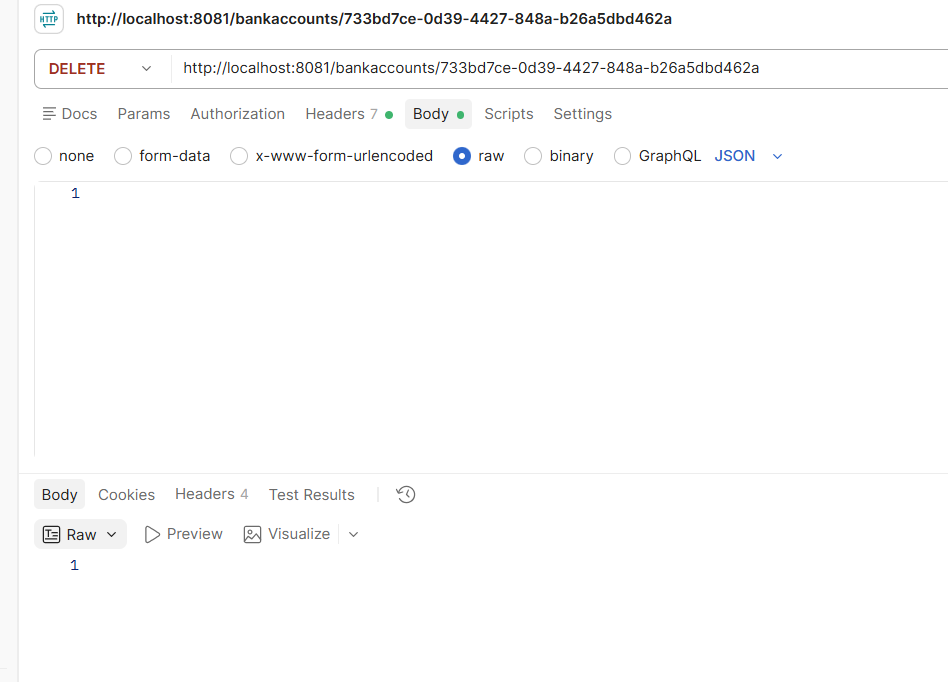