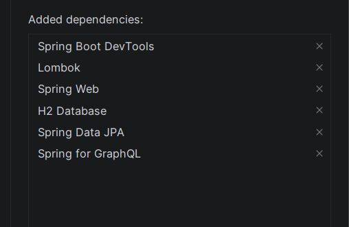
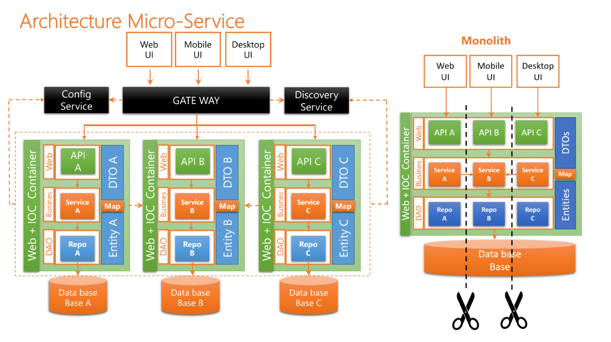
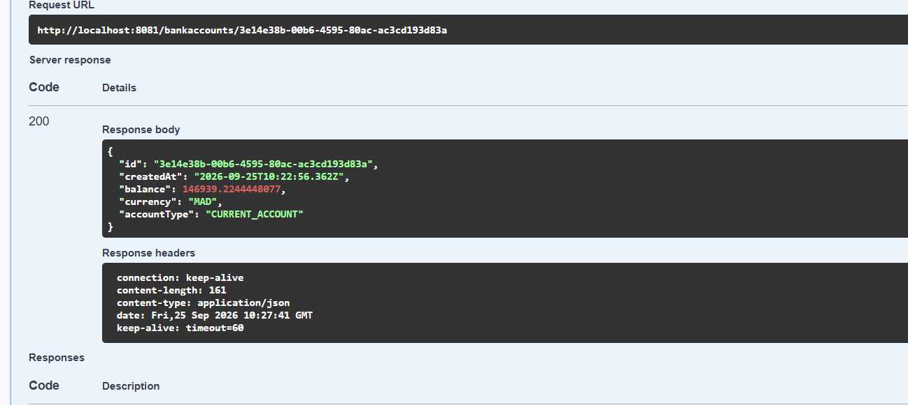
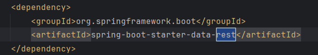
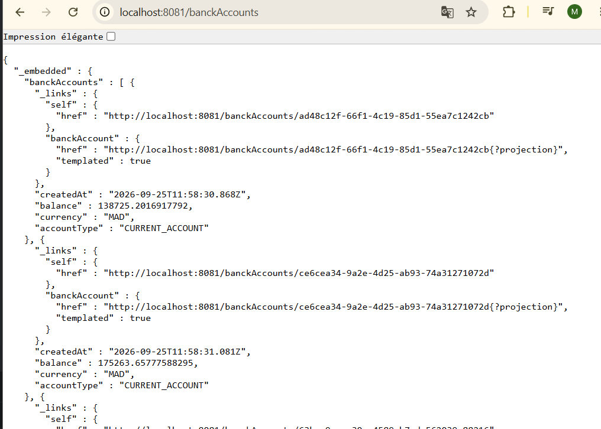
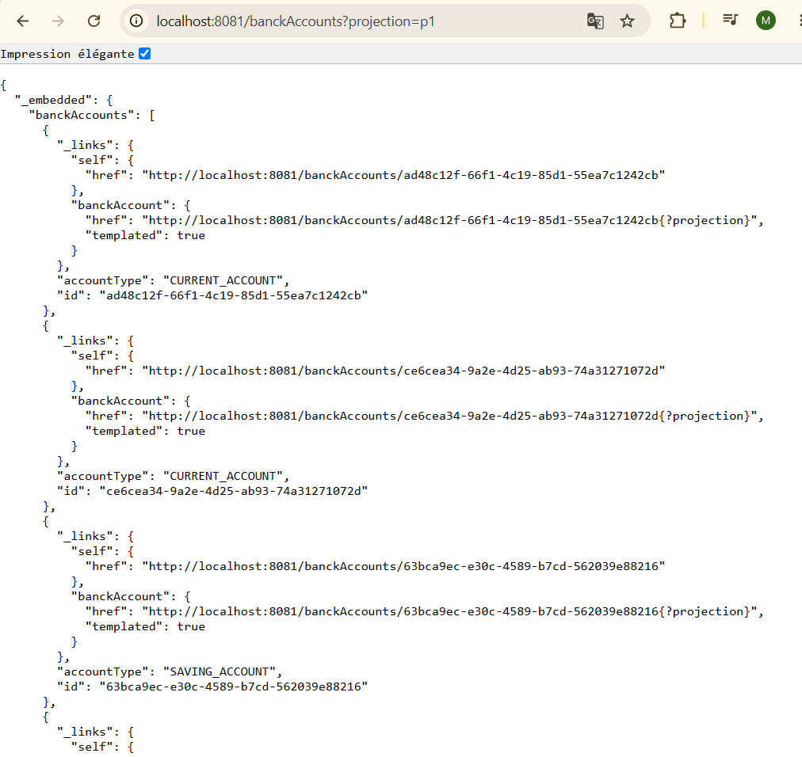
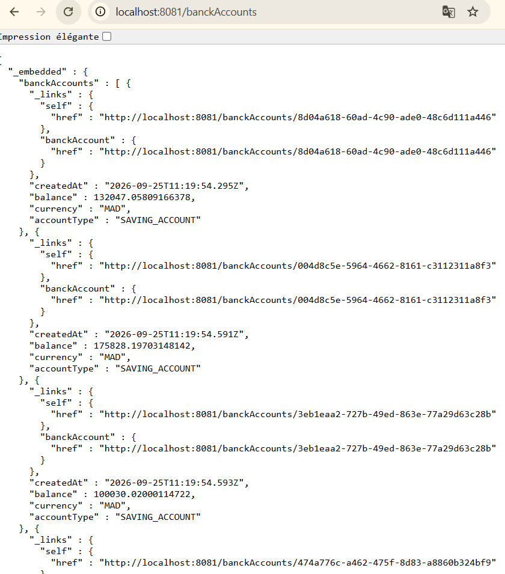

# Microservice de gestion des comptes bancaires
Dans le cadre de la mise en pratique des notions étudiées en **architecture microservices**, nous avons commencé par la réalisation d'un **microservice de gestion de comptes bancaires** avec **Spring Boot**.

L'objectif de ce projet est de mettre en pratique progressivement les différents concepts et technologies nécessaires à la conception d'un microservice, en commençant par la création d'une API REST, puis en ajoutant différentes fonctionnalités et couches à l'application.

Ce microservice permet de gérer des comptes bancaires à travers plusieurs types d'API :

- **REST API classique**
- **Spring Data REST**
- **GraphQL API**


# Étapes de réalisation

## 1. Création du projet Spring Boot

La première étape consiste à créer un projet **Spring Boot** avec les dépendances nécessaires au développement du microservice.

###  Dépendances utilisées


---

## 2. Création de l'entité JPA `Compte`

L'entité `BankAccount` représente un compte bancaire dans l'application.

Elle est associée à une table dans la base de données grâce à **JPA**.

###  Structure de l'entité


## 3. Création de l'interface `CompteRepository`

Pour accéder aux données de l'entité `BankAccount`, une interface `BankAccountRepository` est créée.

Elle hérite de `JpaRepository`, ce qui permet de bénéficier automatiquement des principales opérations **CRUD**.


## 4. Test de la couche DAO

La couche **DAO (Data Access Object)** est ensuite testée afin de vérifier que la communication entre l'application et la base de données fonctionne correctement.


## 5. Création du Web Service RESTful

Après avoir mis en place l'entité `BankAccount` et le `BankAccountRepository`, l'étape suivante consiste à créer un **Web Service RESTful** permettant aux clients externes de gérer les comptes bancaires.

Pour cela, un contrôleur REST est créé à l'aide de l'annotation `@RestController`.

    
   

`
## 6. Test du microservice avec Postman

Après la création du Web Service REST, le microservice est testé à l'aide de **Postman** afin de vérifier le bon fonctionnement des différentes opérations CRUD.

###  Tests réalisés

Les différentes opérations testées sont :

| Méthode HTTP | Endpoint                 | Description |
|---|--------------------------|---|
| `GET` | `/api/bankAccounts`      | Récupérer tous les comptes |
| `GET` | `/api/bankAccounts/{id}` | Récupérer un compte par son identifiant |
| `POST` | `/api/bankAccounts`      | Créer un nouveau compte |
| `PUT` | `/api/bankAccounts/{id}` | Modifier un compte |
| `DELETE` | `/api/bankAccounts/{id}`      | Supprimer un compte |

###  Création d'un compte


### Récupération des comptes


###  Récupération d'un compte


###  Modification d'un compte


###  Suppression d'un compte


## 7. Documentation des API REST avec Swagger / OpenAPI

Afin de faciliter la documentation et le test des API REST, **Swagger / OpenAPI** est intégré au projet.
### Dépendance utilisée

La dépendance suivante est ajoutée dans le fichier `pom.xml` :


### Accès à Swagger UI

Après le démarrage de l'application, l'interface Swagger UI est accessible à l'adresse :

```text
http://localhost:8081/swagger-ui/index.htmlhtml
```


Elle permet de visualiser les différentes API REST disponibles et de tester directement les endpoints.

###  Documentation OpenAPI

La spécification OpenAPI générée automatiquement est également accessible via :

```text
http://localhost:8081/v3/api-docs
```

### Tests avec Swagger

Swagger permet de tester directement les différentes opérations du microservice :





## 8. Exposition d'une API REST avec Spring Data REST et Projections

Dans cette étape, nous utilisons **Spring Data REST** afin d'exposer automatiquement les ressources de notre application sous forme d'API REST, directement à partir du `Repository`.

### Dépendance utilisée

La dépendance suivante est ajoutée dans le fichier `pom.xml` :



 L'annotation `@RepositoryRestResource` est ajoutée sur l'interface `BankAccountRepository` afin de demander à **Spring Data REST** d'exposer automatiquement le repository sous forme d'une API REST.

###  Test de l'API

Après le démarrage de l'application, les ressources exposées peuvent être testées avec Postman ou directement depuis le navigateur.




L'image suivante montre l'utilisation de la **projection** afin de retourner uniquement les attributs sélectionnés de l'entité `BankAccount`.



## 9. Création des DTOs et des Mappers

Afin de séparer les données exposées par l'API de l'entité JPA, nous avons créé des **DTOs** pour les requêtes et les réponses.

###  DTOs

- `BanckAccountRequestDTO` : données reçues lors d'une création ou modification.
- `BanckAccountResponseDTO` : données retournées au client.

###  Mapper

Un mapper permet de convertir l'entité `BanckAccount` en DTO de réponse et un mapper pour   convertir DTO de request en `BanckAccount`


## 10. Création de la couche Service

Une **couche Service** est ajoutée afin de centraliser la logique métier de l'application et de séparer cette logique du contrôleur.

Le service utilise le `BankAccountRepository` pour effectuer les opérations sur les comptes.


## 11. Création d'un Web Service GraphQL

Dans cette dernière étape, nous avons ajouté une **API GraphQL** au microservice de gestion des comptes bancaires.

L'objectif est de permettre au client d'interroger et de manipuler les comptes bancaires à travers GraphQL.

###  Création du schéma GraphQL

Le schéma GraphQL est défini dans le fichier :

```text
src/main/resources/graphql/schema.graphqls
```

Il permet de définir les types disponibles ainsi que les opérations accessibles par le client.


###  Les Query

Une **Query** permet de récupérer des données sans les modifier.

Dans notre cas, deux opérations sont définies :

* `accountsList` : récupérer la liste des comptes ;
* `accountById` : récupérer un compte à partir de son identifiant.
* `customersList` : récupérer la liste des clients ;

### Les Mutation

Une **Mutation** permet de modifier les données, par exemple pour créer, modifier ou supprimer une ressource.

Dans notre projet, trois mutations sont implémentées :

- `createaccount` : créer un nouveau compte bancaire ;
- `updateaccount` : modifier un compte bancaire existant ;
- `deleteaccount` : supprimer un compte bancaire à partir de son identifiant.

### Création du contrôleur GraphQL

Un contrôleur dédié permet de relier les opérations définies dans le schéma GraphQL aux méthodes Java.


### Gestion des erreurs GraphQL

Afin d'améliorer la gestion des erreurs retournées par l'API GraphQL, un resolver d'exception personnalisé est ajouté au projet.

La classe `BankAccountFetcherExceptionResolver` hérite de `DataFetcherExceptionResolverAdapter` et permet d'intercepter les exceptions générées lors de l'exécution des opérations GraphQL.


Cette configuration permet notamment de retourner au client le message de l'exception au lieu d'une erreur GraphQL générique.


###  Test du service GraphQL

Les différentes opérations GraphQL sont testées afin de vérifier leur bon fonctionnement.




